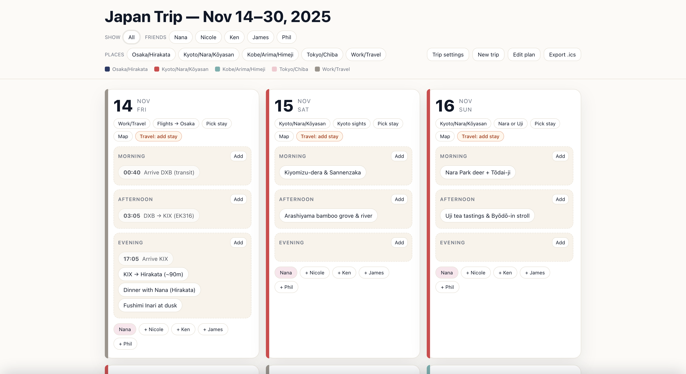

# Japlan

> A tactile, data-driven itinerary planner for multi-city adventures in Japan.


<!--  -->

## Table of contents
- [Japlan](#japlan)
  - [Table of contents](#table-of-contents)
  - [Overview](#overview)
  - [Highlights](#highlights)
  - [Quick start](#quick-start)
  - [Customize the trip](#customize-the-trip)
  - [UI tour](#ui-tour)
  - [Tech stack](#tech-stack)
  - [Project structure](#project-structure)
  - [Development notes](#development-notes)
  - [Roadmap ideas](#roadmap-ideas)
  - [Credits](#credits)

## Overview
Japlan is a fully client-side trip planning workspace tailored for a two-week journey across Osaka, Kyoto, Kobe, and Tokyo. It blends a Kanban-style daily calendar, rich catalog data, and Google Maps + Places-powered mapping to help you choreograph activities, stays, and travel with friends. The default dataset ships with an Autumn 2025 itinerary, but every piece—from colors to catalog items—is easy to retheme for your own adventure.

## Highlights
- **Itinerary-first workflow** – Drag cards into morning, afternoon, or evening slots, lock essential items, and keep track of travel windows directly in the day view.
- **Filterable context** – Toggle friends or locations with pill chips to focus on just the plans that matter and watch the calendar reflow instantly.
- **Map overlays** – Pop open a modal map for any day to visualize clustered stops, driving directions, and walking paths using Google Maps markers, polylines, and info windows.
- **Trip intelligence** – Export the plan as an `.ics` calendar, auto-fill themes per city, and persist edits in `localStorage` so progress survives reloads.
- **Accessible, keyboard-friendly UI** – Tab through action bars, use Escape to dismiss overlays, and benefit from semantic HTML with ARIA roles.

## Quick start
Japlan is a static web experience—no build tooling required. Any simple HTTP server works, but the snippet below uses Python's built-in module.

```bash
# Clone the repo and move into it
git clone https://github.com/your-org/japlan.git
cd japlan

# Launch a local dev server (http://localhost:8000)
python -m http.server 8000
```

Then open [`http://localhost:8000`](http://localhost:8000) in your browser. Your itinerary edits are stored locally in the browser, so refreshes are safe. To reset everything, clear the "Trip Planner" data from the Application/Storage tab in developer tools.

## Customize the trip
Everything the planner renders is driven by `scripts/data.js`. Update a few keys to retheme the experience:

- **Trip metadata** – Rename `tripName`, adjust the `range`, and swap out `friends` for your travel party.
- **Color palette** – Tailor `locations` and `friendColors` to personalize chips, legends, and map pins.
- **Catalog content** – Populate `catalog.activity`, `catalog.stay`, and `catalog.booking` with the spots you care about; each item can include coordinates for the map overlay.
- **Routing & places** – Provide a Google Maps Platform key via `routing.googleApiKey` to unlock live directions, Street View, and rich Places details. Use the `mapPlaces` object to associate map pins with Google place IDs or search queries for sharper metadata.

Because the state is normalized at load time, you can remove locations, change date ranges, or even ship the planner with a blank slate.

## UI tour
- **Global toolbar** – Switch between all items and friend/location filters, open trip settings, create a new itinerary, toggle edit mode, or export an iCalendar file.
- **Daily cards** – Each date lists theme notes, stay details, plus morning/afternoon/evening slots ready for drag-and-drop activities. Travel rows surface transit windows and map buttons.
- **Catalog side sheet** – Click "Add" on any slot to open a three-tab sheet (Activities, Stays, Bookings) with search, quick actions, and contextual friend tags.
- **Map dialog** – Tap "Map" to summon a Google Maps overlay summarizing the day's stops, colored by location, with optional routing lines when API credentials are present.
- **Legend & chips** – A responsive legend and chip set keep color meanings obvious while providing quick visual grouping cues.

## Tech stack
- **HTML5 & semantic landmarks** for accessible structure.
- **Modern CSS** (Flexbox, Grid, clamp-based typography) for adaptive layouts without external frameworks.
- **Vanilla ES modules** orchestrating state, drag interactions, filtering, and persistence.
- **[Google Maps JavaScript API](https://developers.google.com/maps/documentation/javascript)** + Places for rich mapping, routing, and place metadata.

## Project structure
```
├── index.html          # Page shell and mounting points
├── styles.css          # Design system, layout, and interaction styles
├── scripts/
│   ├── app.js          # Main application logic
│   └── data.js         # Trip template & configuration knobs
└── assets/
    ├── trip-planner-overview.png
    └── trip-planner-map.png
```

## Development notes
- The app auto-saves on each interaction—`localStorage` entries are versioned via `STORAGE_KEY` for safe upgrades.
- Drag and drop uses native pointer events; when reorganizing slots, Japlan respects "locked" items and friend associations.
- ICS export builds a full `VEVENT` block per day with JST timezone data baked in.
- When editing colors, use the `COLOR_PALETTES` helpers in `data.js` for inspiration.

## Roadmap ideas
- Import/export JSON templates to share itineraries with friends.
- Offline-enabled PWA packaging for on-the-go access.
- Multi-user collaboration via Firebase or Supabase.
- Travel time estimation using Google Maps or other routing providers.

## Credits
- UI + data curated by the Japlan project team.
- Mapping powered by Google Maps Platform (ensure your usage complies with the Maps/Places terms).
- Calendar export structure follows the [RFC 5545](https://www.rfc-editor.org/rfc/rfc5545) iCalendar specification.
